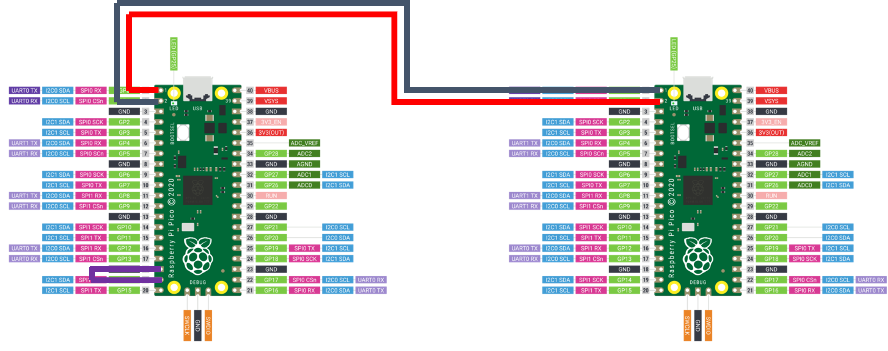
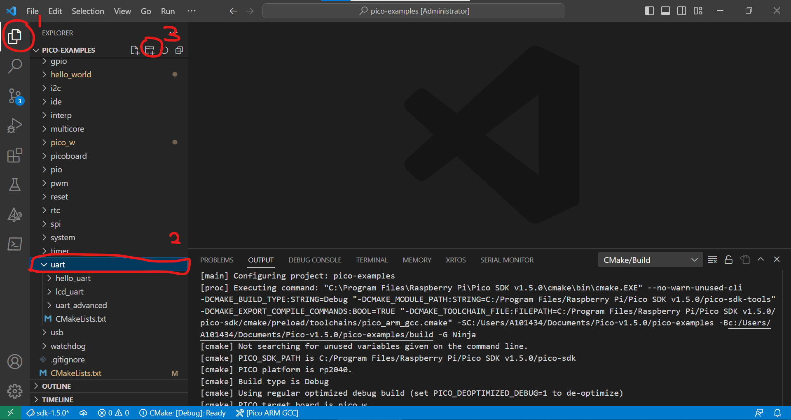
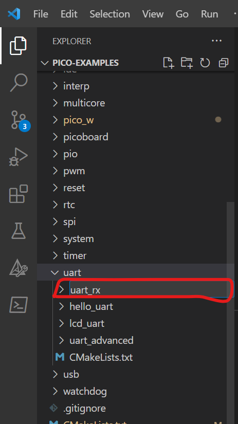
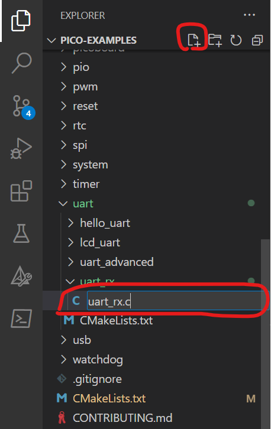
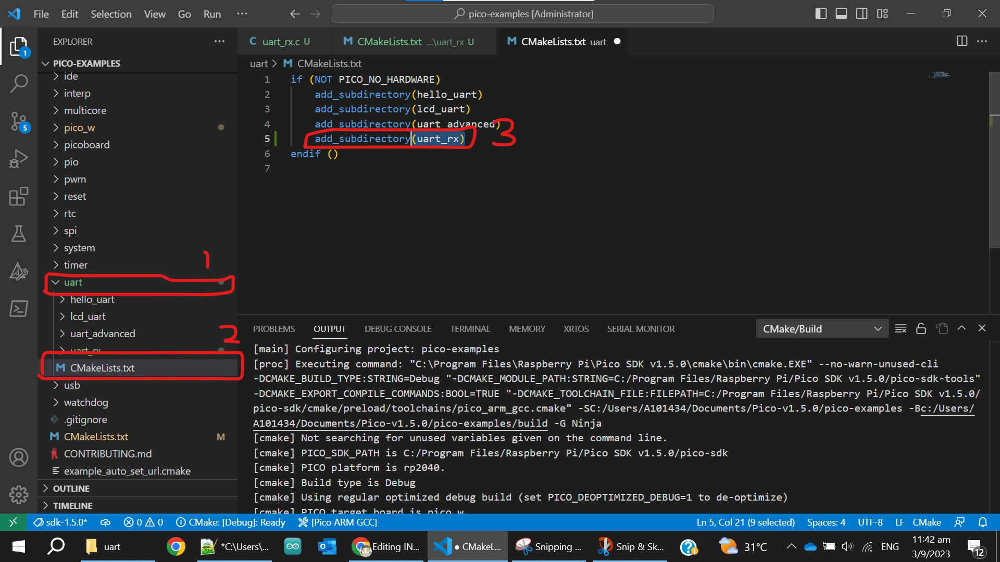
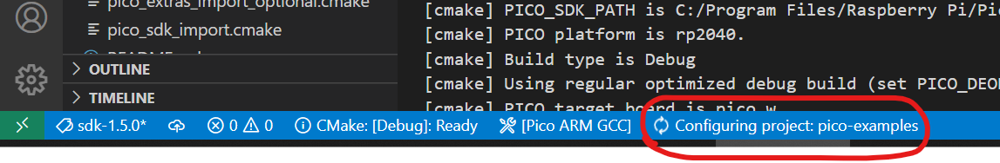
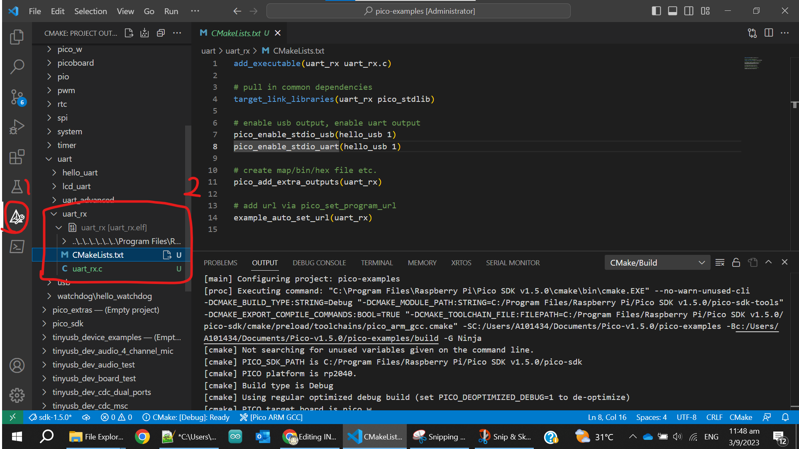

# LAB 2: GPIO and Digital Communication

**OBJECTIVES**
- To better understand and use library functions.
- Configuring GPIO as input and output
- Configuring UART communication.
- To setup a new blank project.

**EQUIPMENT** 
1.	A laptop that has the Pico C/C++ SDK installed
2.	Raspberry Pico W
3.	Micro-USB Cable
4.	F-F Jumper wire (at least 3)

> [NOTE]
> Only students wearing fully covered shoes are allowed in the SR6A lab due to safety.

## **INTRODUCTION** 

In this lab, our primary focus will be on the General Purpose Input/Output (GPIO) capabilities of the Raspberry Pi Pico. GPIO allows us to interact with various external components, such as LEDs, buttons, and sensors, by setting pins as __inputs__ or __outputs__ to read or write values to them. It's the foundational building block for many microcontroller-based projects. We will delve into Serial Communication, an essential communication protocol that aids in the seamless transfer of data between Picos. With these topics, we'll embark on a hands-on exploration to deepen our understanding of the Pico C SDK's capabilities including creating your own project from blank. Let's begin our journey!

## **DEFINES and MACROS** 

Preprocessor directives like defines and macros are often used when programming embedded systems to make the code more readable and easier to maintain.  In C programming, #define is a preprocessor directive used to create "macros." While they're often discussed interchangeably, #define is the mechanism, and the macro is the result. Macros can represent values or pieces of code and are a form of text substitution done __before compilation__. They're not true functions or variables, so they don't have types or memory allocations. Though they can make code more efficient, they might also introduce complexity or errors if not used cautiously.

```
#define PI 3.14159
#define MIN(a, b) ((a) < (b) ? (a) : (b))
```
In the above example, PI is a simple macro representing the value 3.14159, and MIN is a macro that computes the minimum of two values.

## **GPIO - INPUT** 

We will be building the [blink](https://github.com/raspberrypi/pico-examples/blob/master/pico_w/wifi/blink/picow_blink.c) sample code for the Pico W. This time, we have a better understanding of GPIO and what we need to do to configure an LED. Unfortunately, the user cannot use the button on the Pico W (its for boot select only). Now that we are using the Pico W together with the Maker board, we have access to three buttons. In this example, we will demonstrate how to use a button connected to GP20. These buttons are connected via a pull-up circuit, so they need to be configured accordingly.

The modified code, [picow_blink_button](picow_blink_button.c), configures GP20 as an input with a pull-up resistor. When the button connected to GP20 is not pressed, the pin remains in a high state. Pressing the GP20 button will pull the pin low, causing the LED to stop blinking (as defined in the code). Releasing the button returns the pin to a high state, allowing the LED to resume blinking.

However, if the button circuitry is supposed to be active-high, then the GPIO pin must be configured to a pull-down mode.

The images below illustrate how a pull-up configuration would be used as a GP20 button on the Pico W.


## **GPIO - OUTPUT** 

This [code](pulse.c) demonstrates generating a custom signal using a GPIO pin on a Raspberry Pi Pico. The GPIO pin connected to an LED is programmed to create a bespoke pulse by turning the LED on for 1 second (representing a "high" signal) and then turning it off for 2 seconds (representing a "low" signal). This is then repeated using the while loop. Various pulses can be generates using this method.


## **SERIAL COMMUNICATIONS**

In this task, you will need to work in a pair. Person A will be building the sample code for [hello_uart](https://github.com/raspberrypi/pico-examples/blob/master/uart/hello_uart/hello_uart.c) that would send char data via the serial pins (not USB cable). While Person B will compile [uart_rx](uart_rx.c) using a new project that is shown in the next section. Remember to make sure the Pico_A GP0 will connect to Pico_B GP1 and vice-versa. Do include a while-loop so that the sender (Pico A) will continuously send the characters. The image below illustrates how to connect the two Pico W together via the UART. Take note that the cables are swapped. 


## **Creating your own Project (in VSC)** 

Go ahead and create a directory to house your new project. As in the previous task, we compiled a pico example project called [hello_uart](https://github.com/raspberrypi/pico-examples/blob/master/uart/hello_uart/hello_uart.c) that will send three characters (one at a time) via the UART_TX located on pin 0 on the Raspberry Pi Pico.  In this task, we shall create a folder (under Explorer) within the UART as shown below.





Add a C file with the name uart_rx.c



Add a text file with the name ["CMakeLists.txt"](CMakeLists.txt). Ensure the filename is correct. A mistake here will lead to errors.


Go to uart's folder CMakeLists.txt (see below) and include the "add_subdirectory(uart_rx)" into the file in line #5.



Once you have saved this CMakeList.txt file, it will configure the project and create the build folder.




Now, you can go to CMake tool and build your new project.

> [NOTE]> There is an error in the screenshot above. Do use the correct [CMakeLists.txt](CMakeLists.txt) file in the repository.
## **EXERCISE**

The application uses UART communication via GPIO pins GP8 (TX) and GP9 (RX) on UART1 for data transmission and reception. It also includes conditional logic based on the state of button GP22. The functionality can be explained as follows:

When button GP22 is **not pressed**: The software sends the numeric value '1' through UART1 every 1 second.

When button GP22 is **pressed**: The software transmits uppercase English alphabet characters sequentially, starting from 'A' to 'Z', with a 1-second delay between each character. After reaching 'Z', it loops back to 'A'. For example, if GP22 is pressed, the output would be 'A', then 'B', and so on, with a new letter sent every 1 second.

For data reception, the software utilizes the UART1 receiver. When it reads incoming data (see Note #1):

If the data is an uppercase alphabet character (e.g., 'A', 'B'), the software converts it to the corresponding lowercase character (e.g., 'a', 'b'). The transformed character is then printed to the serial terminal.

If the received data is '1', the software will print the number '2' instead.


 > [NOTE 1]> By connecting GP8 to GP9, we effectively create a UART loopback, meaning the transmitted data from the TX pin (GP8) is immediately received by the RX pin (GP9). This allows the Pico to both send and receive data in a self-contained loop, which is useful for testing and debugging the UART functionality.

 > [NOTE 2]> If you're experiencing random character outputs in your lab exercise, try replacing stdio_init_all() with stdio_usb_init().
