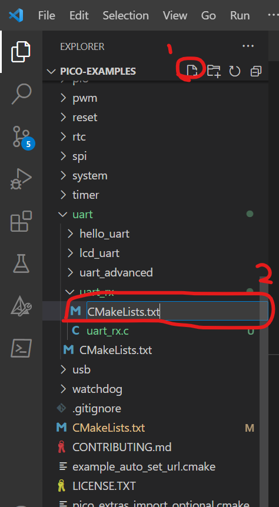

# LAB 2: GPIO and Digital Communication

**OBJECTIVES**
- To better understand and use library functions.
- Configuring GPIO as input and output
- Configuring UART communication.
- Compiling I2C and SPI examples.
- To setup a new blank project.

**EQUIPMENT** 
1.	A laptop that has the Pico C/C++ SDK installed
2.	Raspberry Pico W
3.	Micro-USB Cable
4.	1x Male-Male Jumper wire

> [NOTE]
> Only students wearing fully covered shoes and long pants are allowed in the lab for safety reasons.

## **INTRODUCTION** 

In this lab, we will dive into the **General Purpose Input/Output (GPIO)** capabilities of the Raspberry Pi **Pico W**, which are the foundation for interacting with external components such as LEDs, buttons, and sensors. GPIO pins can be configured as inputs or outputs, allowing the Raspberry Pi Pico W to read data from sensors or control devices like motors and displays. These pins are the backbone of many microcontroller-based projects, enabling developers to create various embedded systems applications.

However, the Pico W's GPIO pins are more than simple input/output points. Each pin on the Pico W is **multiplexed**, meaning it can serve multiple functions—such as **UART, SPI, I2C**, or **PWM**—depending on how the pin is configured in your code. For example, a single pin could be used for UART communication in one project and SPI communication in another. Because of this flexibility, developers must carefully plan and decide which GPIO pins to use for each function before starting their project. Improper pin assignments could lead to conflicts, making certain peripherals unusable or causing unexpected behaviour.

In this lab, we will also explore **Serial Communication**, an essential protocol that enables the efficient transfer of data between two Pico W boards (or other devices) over a wired connection. Specifically, we will focus on the **UART** (Universal Asynchronous Receiver-Transmitter), **I2C**, and **SPI** protocols, each serving different use cases depending on the type of data transfer required. For example, SPI is commonly used for high-speed communication with sensors or displays, while I2C is great for communicating with multiple devices using fewer wires.

In addition to learning about GPIO and serial communication, you'll have the opportunity to create a project from scratch using the **Pico C SDK**. You'll experience hands-on coding, compiling, and deploying a project while gaining insight into the flexibility of the Pico W's architecture.

Through this lab, you’ll enhance your practical skills and develop a deeper understanding of how to plan, configure, and utilize the versatile GPIO and communication features of the Raspberry Pi Pico W.

Let’s begin our journey into embedded systems and serial communication with the Raspberry Pi Pico W!


## **DEFINES and MACROS** 

Preprocessor directives like defines and macros are often used when programming embedded systems to make the code more readable and easier to maintain.  In C programming, #define is a preprocessor directive used to create "macros." While they're often discussed interchangeably, #define is the mechanism, and the macro is the result. Macros can represent values or pieces of code and are a form of text substitution done __before compilation__. They're not true functions or variables, so they don't have types or memory allocations. Though they can make code more efficient, they might also introduce complexity or errors if not used cautiously.

```
#define PI 3.14159
#define MIN(a, b) ((a) < (b) ? (a) : (b))
```
In the above example, PI is a simple macro representing the value 3.14159, and MIN is a macro that computes the minimum of two values.

## **GPIO - INPUT** 

We will be building the [blink](https://github.com/raspberrypi/pico-examples/blob/master/pico_w/wifi/blink/picow_blink.c) sample code for the Pico W. This time, we have a better understanding of GPIO and what we need to do to configure an LED. Unfortunately, the user cannot use the button on the Pico W (its for boot select only). Now that we are using the Pico W together with the Maker board, we have access to three buttons. In this example, we will demonstrate how to use a button connected to GP20. These buttons are connected via a pull-up circuit, so they need to be configured accordingly.

The modified code, [picow_blink_button](picow_blink_button.c), configures GP20 as an input with a pull-up resistor. When the button connected to GP20 is not pressed, the pin remains in a high state. Pressing the GP20 button will pull the pin low, causing the LED to stop blinking (as defined in the code). Releasing the button returns the pin to a high state, allowing the LED to resume blinking.

However, if the button circuitry is supposed to be active-high, then the GPIO pin must be configured to a pull-down mode.

The images below illustrate how a pull-up configuration would be used as a GP20 button on the Pico W.


## **GPIO - OUTPUT** 

This [code](pulse.c) demonstrates generating a custom signal using a GPIO pin on a Raspberry Pi Pico. The GPIO pin connected to an LED is programmed to create a bespoke pulse by turning the LED on for 1 second (representing a "high" signal) and then turning it off for 2 seconds (representing a "low" signal). This is then repeated using the while loop. Various pulses can be generates using this method.


## **SERIAL COMMUNICATIONS - UART**

In this task, you will work in pairs. **Pico A** will compile and run the sample code for [hello_uart](https://github.com/raspberrypi/pico-examples/blob/master/uart/hello_uart/hello_uart.c), which will send character data via the serial pins (instead of the USB cable). While **Pico B** will compile and run [uart_rx](uart_rx.c) using a new project (see next section on how to create a new project).

To successfully exchange data between the two Pico W boards, it is essential to connect **Pico A**'s GP0 (TX) to **Pico B**'s GP1 (RX), and vice-versa. Here's why:
- Connecting GP0 of **Pico A** to GP1 of **Pico B**: GP0 on Pico A is configured as the transmit pin (TX), which sends data. GP1 on **Pico B** is configured as the receive pin (RX), which listens for incoming data. **Pico A** can send data that **Pico B** will receive by connecting them. Additionally, you should connect **Pico B**'s GP0 (TX) to **Pico A**'s GP1 (RX), allowing data transmission in both directions (if needed).
Ground (GND) connection: Both Pico W boards must share a common ground (**GND**) to establish a reliable electrical connection. Without connecting the GNDs of both boards, the voltage levels may be inconsistent, potentially causing communication issues or data corruption. By linking the grounds, you ensure both boards have the same reference point for voltage, enabling stable and correct data transmission.

Please ensure that **Pico A** includes a while-loop so the sender continuously transmits characters to **Pico B**. The image below illustrates the correct wiring setup for connecting the two Pico W boards via UART, showing the TX and RX cables swapped between the boards.


> [NOTE]: The key difference between `hello_usb` and `hello_uart` in the Pico examples is that `hello_usb` sends output through the USB interface, displaying messages on the connected computer's terminal, while `hello_uart` transmits data via the UART pins (TX/RX), allowing communication with other devices over a serial connection.

> [NOTE]:  Guide on how to connect, compile and execute the examples for I2C and SPI can be found [here](digcomms.md).

## **Creating your own Project (in VSC)** 

Creating your own project folder in VSCode helps keep your code organized and makes it easier to manage multiple files, especially in larger projects. By having a dedicated folder for each project, you can neatly separate different sets of code, configurations, and resources, preventing clutter. This makes it easier to navigate your project, track changes, and share it with others. Additionally, VSCode uses this structure to recognize your project environment, allowing it to handle tasks like compiling, debugging, and version control more effectively. It also keeps your workspace clean and ensures that your projects don’t interfere with each other.

Go ahead and create a directory to house your new project. As in the previous task, we compiled a pico example project called [hello_uart](https://github.com/raspberrypi/pico-examples/blob/master/uart/hello_uart/hello_uart.c) that will send three characters (one at a time) via the UART_TX located on GP0 on the Raspberry Pi Pico.  In this task, we shall create a folder (under Explorer) within the UART as shown below.


Add a C file with the name uart_rx.c


Add a text file with the name ["CMakeLists.txt"](CMakeLists.txt). Ensure the filename is correct. A mistake here will lead to errors.



Go to uart's folder CMakeLists.txt (see below) and include the "add_subdirectory(uart_rx)" into the file in line #5.


Once you have saved this CMakeList.txt file, it will configure the project and create the build folder.


Now, you can go to CMake tool and build your new project.

> [NOTE]: There is an error in the screenshot above. Do use the correct [CMakeLists.txt](CMakeLists.txt) file in the repository.
## **EXERCISE**

The application uses UART communication via GPIO pins GP8 (TX) and GP9 (RX) on UART1 for data transmission and reception. It also includes conditional logic based on the state of button GP22. The functionality can be explained as follows:
- When button GP22 is **not pressed**: The software sends the numeric value '1' through UART1 every 1 second.
- When button GP22 is **pressed**: The software transmits uppercase English alphabet characters sequentially, starting from 'A' to 'Z', with a 1-second delay between each character. After reaching 'Z', it loops back to 'A'. For example, if GP22 is pressed, the output would be 'A', then 'B', and so on, with a new letter sent every 1 second.

For data reception, the software utilizes the UART1 receiver. When it reads incoming data (see Note #1):
- If the data is an uppercase alphabet character (e.g., 'A', 'B'), the software converts it to the corresponding lowercase character (e.g., 'a', 'b'). The transformed character is then printed to the serial terminal.
- If the received data is '1', the software will print the number '2' instead.


 > [NOTE 1]: By connecting GP8 to GP9, we effectively create a UART loopback, meaning the transmitted data from the TX pin (GP8) is immediately received by the RX pin (GP9). This allows the Pico to both send and receive data in a self-contained loop, which is useful for testing and debugging the UART functionality.

 > [NOTE 2]: If you're experiencing random character outputs in your lab exercise, try replacing stdio_init_all() with stdio_usb_init().


## Think & Try It: Bitwise LED Challenge on Pico

Problem:
You have 4 LEDs connected to GPIO pins 2–5 on the Raspberry Pi Pico. Treat these LEDs as the 4 bits of a binary number. Start with the value 0001 (only the rightmost LED is ON).
Button A: Each press shifts the LED pattern left (<<) so the next LED lights up. When it reaches the last LED, wrap around to the first.
Button B: Each press toggles (^) the rightmost LED ON/OFF without affecting the others.
Use bitwise operators (|, &, ^, ~, <<, >>) to update and display the LED states.
