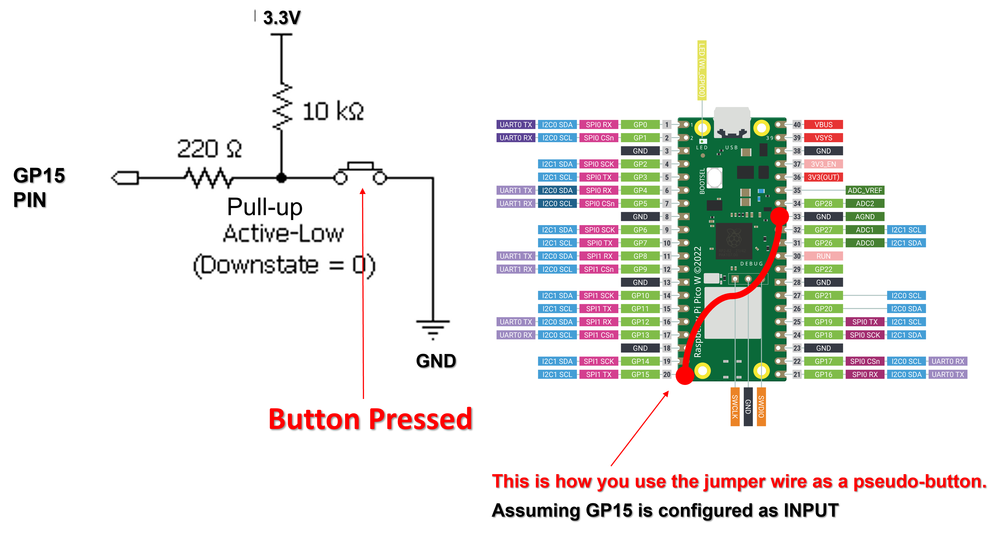
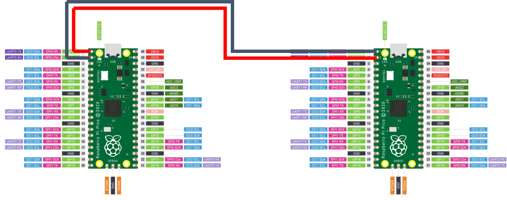
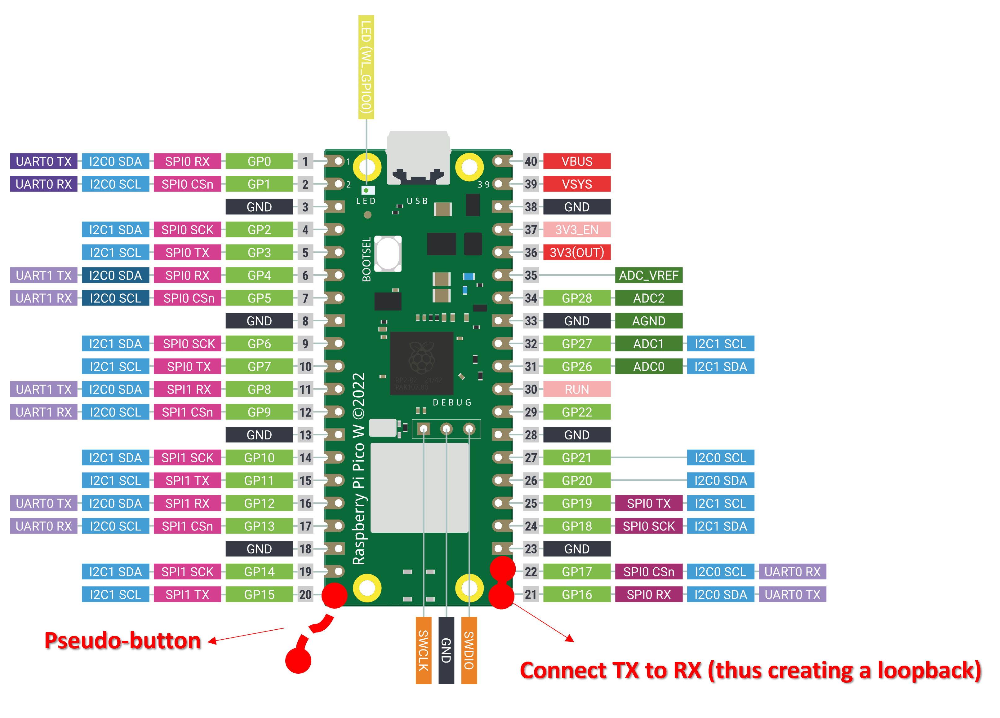

# LAB 2: GPIO and Digital Communication

**OBJECTIVES**
- To better understand and use library functions.
- Configuring GPIO as input and output
- Configuring UART communication.
- To setup a new blank project.

**EQUIPMENT** 
1.	A laptop that has the Pico C/C++ SDK installed
2.	Raspberry Pico W
3.	Micro-USB Cable
4.	F-F Jumper wire (at least 3)

> [NOTE]
> Only students wearing fully covered shoes are allowed in the SR6A lab due to safety.

## **INTRODUCTION** 

In this lab, our primary focus will be on the General Purpose Input/Output (GPIO) capabilities of the Raspberry Pi Pico. GPIO allows us to interact with various external components, such as LEDs, buttons, and sensors, by setting pins as __inputs__ or __outputs__ to read or write values to them. It's the foundational building block for many microcontroller-based projects. We will delve into Serial Communication, an essential communication protocol that aids in the seamless transfer of data between Picos. With these topics, we'll embark on a hands-on exploration to deepen our understanding of the Pico C SDK's capabilities including creating your own project from blank. Let's begin our journey!

## **DEFINES and MACROS** 

Preprocessor directives like defines and macros are often used when programming embedded systems to make the code more readable and easier to maintain.  In C programming, #define is a preprocessor directive used to create "macros." While they're often discussed interchangeably, #define is the mechanism, and the macro is the result. Macros can represent values or pieces of code and are a form of text substitution done __before compilation__. They're not true functions or variables, so they don't have types or memory allocations. Though they can make code more efficient, they might also introduce complexity or errors if not used cautiously.

```
#define PI 3.14159
#define MIN(a, b) ((a) < (b) ? (a) : (b))
```
In the above example, PI is a simple macro representing the value 3.14159, and MIN is a macro that computes the minimum of two values.

## **GPIO** 

We will be building the [blink](https://github.com/raspberrypi/pico-examples/blob/master/pico_w/wifi/blink/picow_blink.c) sample code for the Pico W. This time we have a better understanding of what GPIO is and what we need to do to configure an LED. Unfortunately, the button on the Pico cannot be used by the user. Therefore, we will create a pseudo-button where we will configure the GPIO as input and connect it to 3.3v or GND to simulate on and off.

This modified code, [picow_blink_button](picow_blink_button.c), configures the GP14 as an input with a pull-up resistor. What this means is that when the button is not pressed (disconnected), it will have a high state. To activate (aka pressing) this pseudo-button, you connect it to low (or GND). Connecting the GP14 to GND will cause the LED to stop blinking. While disconnecting the wire will allow the LED to continue to blink.

If the pseudo-button is supposed to be active-high (connect to 3.3V to activate the button), then the GPIO pin needs to be configured to a pull-down resistor.

The images below illustrate how a pull-up and pull-down configuration would be used as a pseudo-button on the Raspberry Pi Pico W.





## **SERIAL COMMUNICATIONS**

In this task, you will need to work in a pair. Person A will be building the sample code for [hello_uart](https://github.com/raspberrypi/pico-examples/blob/master/uart/hello_uart/hello_uart.c) that would send char data via the serial pins (not USB cable). While Person B will compile [uart_rx](uart_rx.c) using a new project that is shown in the next section. Remember to make sure the Pico_A GP0 will connect to Pico_B GP1 and vice-versa. Do include a while-loop so that the sender (Pico A) will continuously send the characters. The image below illustrates how to connect the two Pico W together via the UART. Take note that the cables are swapped. 


## **Creating your own Project (in VSC)** 

Go ahead and create a directory to house your new project. As in the previous task, we compiled a pico example project called [hello_uart](https://github.com/raspberrypi/pico-examples/blob/master/uart/hello_uart/hello_uart.c) that will send three characters (one at a time) via the UART_TX located on pin 0 on the Raspberry Pi Pico.  In this task, we shall create a folder (under Explorer) within the UART as shown below.


Add a C file with the name uart_rx.c


Add a text file with the name ["CMakeLists.txt"](CMakeLists.txt). Ensure the filename is correct. A mistake here will lead to errors.


Go to uart's folder CMakeLists.txt (see below) and include the "add_subdirectory(uart_rx)" into the file in line #5.


Once you have saved this CMakeList.txt file, it will configure the project and create the build folder.


Now, you can go to CMake tool and build your new project.

> [NOTE]> There is an error in the screenshot above. Do use the correct [CMakeLists.txt](CMakeLists.txt) file in the repository.
## **EXERCISE**

The application is to utilize UART communication through GP16 and GP17 (UART0) for data transmission and reception. The software is equipped with conditional logic that detects the state of PIN20 (GP15) and, based on its status, sends either a numeric value '1' or cycles through uppercase English alphabet characters from 'A' to 'Z' with a one-second delay in between. When GP15 is high, the software transmits the digit '1' through UART0. On the other hand, when GPIO15 is low, the software sequentially sends uppercase alphabet characters, looping back to 'A' after 'Z'. For data reception, the software employs the UART0 receiver functionality. It reads incoming data and processes it accordingly. If the received data is an uppercase alphabet character, the software performs an arithmetic transformation to convert it into lowercase. Subsequently, the converted character is printed using standard output. However, if the received data is the number '1', it will print out the number '2'. 

> [!IMPORTANT]
> GP16 & GP17 are connected with a jumper wire.



 > [NOTE]> If you're experiencing random character outputs in your lab exercise, try replacing stdio_init_all() with stdio_usb_init(). This seems to resolve the issue. (Many Thanks for LING CHOON KEAT)
