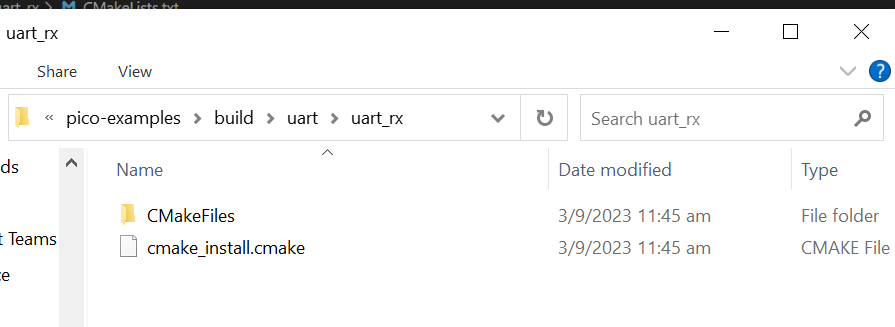

# LAB 2: GPIO and Digital Communication

**OBJECTIVES**
- To setup a new blank project.
- To better understand and use library functions.
- Configuring GPIO as input and output
- Configuring UART communication.

**EQUIPMENT** 
1.	A laptop that has the Pico C/C++ SDK installed
2.	Raspberry Pico W
3.	Micro-USB Cable
4.	F-F Jumper wire (at least 1)

> [NOTE]
> Only students wearing fully covered shoes are allowed in the SR6A lab due to safety.

## **INTRODUCTION** 

In this lab, our primary focus will be on the General Purpose Input/Output (GPIO) capabilities of the Raspberry Pi Pico. GPIO allows us to interact with various external components, such as LEDs, buttons, and sensors, by setting pins as __inputs__ or __outputs__ to read or write values to them. It's the foundational building block for many microcontroller-based projects. We touch upon Direct Register Access to appreciate its role in the granular control of Pico's hardware, allowing us to work with specific storage locations within the microcontroller. We will then delve into Serial Communication, an essential communication protocol that aids in the seamless transfer of data between the Pico and external devices. With these topics, we'll embark on a hands-on exploration to deepen our understanding of the Pico C SDK's capabilities. Let's begin our journey!

## **DEFINES, MACROS and IN-LINE FUNCTIONS** 

Preprocessor directives like defines and macros, and in-line functions are often used when programming embedded systems to make the code more readable and easier to maintain.  Examples of a define, macro and in-line function are given in Code Snippet 2, 3 and 4. The #define directive, used for defines and macros, is a preprocessor directive that instructs the compiler to replace certain code parts as defined. In contrast to that, the in-line function is just a request to the compiler. This means, depending on the optimisation configuration of the compiler, function calls to in-line functions can be replaced with the function body or are treated like standard function calls. However, in contrast to macros, in-line functions are subject to strict parameter checking and considered safer.

## **GPIO** 

In this lab session, we learned about the development platform Raspberry Pico and the Pico C/C++ SDK used throughout all lab sessions. We will also familiarise you with concepts like direct register access, polling, and serial communication. The following introduction should give a broad overview of the working environment, but it is optional to understand all the details to complete this laboratory. 

The Raspberry Pi Pico is an affordable microcontroller board developed by the Raspberry Pi Foundation, ideal for electronics projects. It features a dual-core ARM Cortex-M0+ processor, 26 GPIO pins, and supports multiple programming languages. However, it lacks built-in wireless connectivity. The Raspberry Pi Pico Wireless (Pico W) is an enhanced version of the Pico, with built-in Wi-Fi and Bluetooth. This makes it suitable for IoT and wireless communication projects while maintaining compatibility with Pico's programming languages and GPIO pins.

The Raspberry Pi Pico family currently consists of four boards: Raspberry Pi Pico, Pico H, Pico W, and Pico WH.

The following is the pin out for the Raspberry Pi Pico

The following is the pin out for the Raspberry Pi Pico W

The most important documents of an embedded system are, among others, datasheets, user guides, technical reference manuals, application notes, errata or schematics. Therefore, every embedded system comes with many documentation files. All the necessary files for this lab and subsequent labs can be found on the Raspberry Foundation site and supplementary documents will be provided on the course xsite website. It is essential to have access to all parts of the documentation to use the functionality of an embedded system to its fullest extent. Details of the hardware can be found [here](https://www.raspberrypi.com/documentation/microcontrollers/rp2040.html).

## **SERIAL COMMUNICATIONS**

It's especially crucial for debugging. By leveraging functions such as printf, we're able to transmit messages to a connected computer, giving us real-time feedback on our code's behavior.

## **Creating your own Project (in VSC)** 

Go ahead and create a directory to house your new project. As in the previous task, we compiled a pico example project called (hello_uart)[] that will send three characters (one at a time) via the UART_TX located on pin 0 on the Raspberry Pi Pico.  In this task, we shall create a folder (under Explorer) within the UART as shown below.

Add a C file with the name uart_rx.c

Add a text file with the name "CMakeLists.txt". Ensure the filename is correct. A mistake here will lead to errors.

Go to uart's folder CMakeLists.txt (see below) and include the "add_subdirectory(uart_rx)" into the file in line #5.

Once you have saved this CMakeList.txt file, it will configure the project and create the build folder.

Now, you can go to CMake tool and build your new project.

## **EXERCISE**

The application is to utilize UART communication through GP16 and GP17 (UART0) for data transmission and reception. The software is equipped with conditional logic that detects the state of PIN20 (GP15) and, based on its status, sends either a numeric value '1' or cycles through uppercase English alphabet characters from 'A' to 'Z'. When GP15 is high, the software transmits the digit '1' through UART0. On the other hand, when GPIO15 is low, the software sequentially sends uppercase alphabet characters, looping back to 'A' after 'Z' with a one-second delay in between. For data reception, the software employs the UART0 receiver functionality. It reads incoming data and processes it accordingly. If the received data is an uppercase alphabet character, the software performs an arithmetic transformation to convert it into lowercase. Subsequently, the converted character is printed using standard output. However, if the received data is the number '1', it will print out the number '2'. 

> [!IMPORTANT]
> GP16 & GP17 are connected with a jumper wire.

