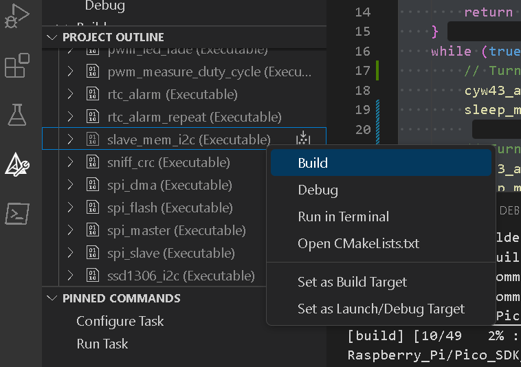

### I2C and SPI Communication on Raspberry Pi Pico W [optional]

#### Overview
I2C (Inter-Integrated Circuit) and SPI (Serial Peripheral Interface) are synchronous communication protocols commonly used in embedded systems for short-distance data transfer between a microcontroller and peripheral devices. I2C operates with two lines, SDA (Serial Data Line) and SCL (Serial Clock Line), allowing multiple devices to communicate on a shared bus through addressing. SPI, on the other hand, uses four lines: MOSI (Master Out Slave In), MISO (Master In Slave Out), SCLK (Serial Clock), and SS (Slave Select), allowing faster, full-duplex communication between a master and multiple slaves. 

UART (Universal Asynchronous Receiver Transmitter) differs from I2C and SPI by being asynchronous, meaning it doesn’t use a clock line for data synchronization. Instead, UART relies on start and stop bits for communication, and both devices must agree on a baud rate. UART typically uses two lines, TX (Transmit) and RX (Receive), for data transmission between two devices. 

The key differences between these protocols include clocking, speed, and the number of wires used. I2C and SPI are clocked (synchronous), while UART is asynchronous. SPI is generally faster than I2C and UART, with more wires involved (four compared to I2C's two and UART's two). Furthermore, I2C supports multiple masters and slaves on a single bus, SPI works with one master and multiple slaves, while UART is designed for point-to-point communication. Each protocol is suited to different applications, and loopback tests are useful for verifying that the respective communication setups are working properly.


---

### **Part 1: I2C Communication Setup**

#### 1.1. **Objective**
This task will demonstrate I2C communication between two Pico W boards, where one board acts as an I2C master and slave, sending data back and forth via the I2C protocol. 

#### 1.2. **Materials**
- 2 Raspberry Pi Pico W boards
- Breadboard and jumper wires
- Computer with VS Code and Pico SDK installed
- USB cables

#### 1.3 **I2C Wiring Table**

| **Pico W (Master)** | **Pico W (Slave)** |
|---------------------|--------------------|
| GP6 (SDA)           | GP4 (SDA)          |
| GP7 (SCL)           | GP5 (SCL)          |
| GND                 | GND                |

This table clearly shows the pin connections between the two Pico W boards for I2C communication.

#### 1.4. **Steps**

1. **Set up the environment**:
   Make sure that the Pico SDK and `pico-examples` are properly set up on your machine. 
2. **Compiling the code**:
   Select the I2C 'slave_mem_i2c' code provided in the example folder and build it (as shown below).
   


5. **Upload the code**: Upload the .UF2 file onto the Pico W.
6. **Run the code**:
   Once the code is uploaded the Pico W's two I2C modules will communicate. The master will write data to the slave's memory, read from it, and print the results on the serial terminal.

#### 1.5. **Expected Observations**

- **Data Transmission**: 
  - The master Pico W will send a message to the slave Pico W, starting from a specific memory address. The address is incremented after each transmission.
  
- **Data Reception**:
  - The slave Pico W will receive the message, store it in its memory, and send a response back to the master. The master will read the data sequentially.

- **Terminal Output**: 
  - The serial terminal will display the sent and received messages. You should observe the following format:
  
    ```
    Write at 0xXX: 'Hello, I2C slave! - 0xXX'
    Read  at 0xXX: 'Hello, '
    Read  at 0xXX: 'I2C slave! - 0xXX'
    ```

> [NOTE]: You will need to edit the CMakeLists.txt file to enable the serial over the USB cable (refer to Lab 1).

---

### Part 2: SPI Communication

#### 2.1. Objective
In this section, we will use the SPI protocol to establish communication between two Raspberry Pi Pico boards, where one Pico acts as the SPI master and the other as the SPI slave.

#### 2.2. Materials
- 2 Raspberry Pi Pico boards
- Breadboard and jumper wires
- Computer with VS Code and Pico SDK installed
- USB cables

#### 2.3. Wiring Diagram
Connect the two Raspberry Pi Pico boards as follows:

### SPI Communication Wiring (Pico A to Pico B)

| **Pico A (Master)** | **Pico B (Slave)** |
|---------------------|--------------------|
| GP18 (SCK)          | GP18 (SCK)         |
| GP19 (TX)           | GP19 (RX)          |
| GP16 (CS)           | GP16 (CS)          |
| GND                 | GND                |


#### 2.4. Steps

1. **Compile the SPI example**:
   Navigate to the `pico_examples/spi/` directory. The examples we will use are 'spi_master' and 'spi_slave' under `spi_master_slave`.
2. **Upload the code**:
   - Flash the `spi_master` example to **Pico A** (Master).
   - Flash the `spi_slave` example to **Pico B** (Slave).

4. **Run the SPI communication**:
   Once the code is uploaded, the two boards should start exchanging data using the SPI protocol.

#### 2.5. Expected Observations
- The master Pico will send data (e.g., a sequence of bytes) to the slave Pico.
- The slave Pico will receive the data and may respond with its own data.
- Using a serial terminal, you can monitor the data exchange and confirm successful SPI communication.

---

### Conclusion

In this lab, we successfully implemented and demonstrated I2C and SPI communication protocols on Raspberry Pi Pico W boards. Through hands-on experience, we established I2C communication between two Pico W I2C communication modules, where the master initiated data transfers to the slave, and the slave responded accordingly. The I2C loopback test provided an example of debugging and testing I2C protocol.

Similarly, we explored SPI communication by configuring one Pico as the master and another as the slave. This exercise showcased the full-duplex nature of SPI, where both devices exchanged data simultaneously over separate data lines. The faster speed and direct data lines of SPI make it ideal for high-throughput applications, as seen in this test scenario.

Overall, this lab demonstrated the practical differences between I2C and SPI, highlighting the strengths of each protocol for different embedded system applications. These exercises helped reinforce key concepts such as synchronous communication, pin configuration, and data exchange mechanisms, providing a solid foundation for future projects involving these protocols.
